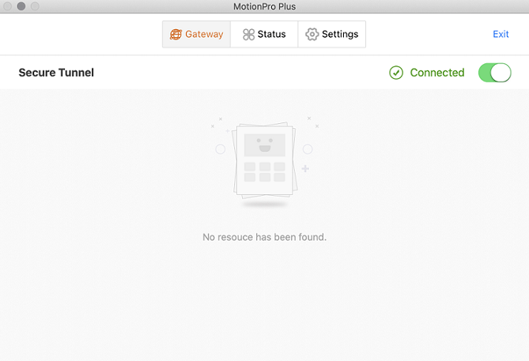

---

copyright:
  years: 1994, 2017-2019
lastupdated: "2019-11-11"

keywords: SSL VPN, mac0S

subcollection: iaas-vpn

---

{:shortdesc: .shortdesc}
{:new_window: target="_blank"}
{:codeblock: .codeblock}
{:pre: .pre}
{:screen: .screen}
{:term: .term}
{:tip: .tip}
{:note: .note}
{:important: .important}
{:deprecated: .deprecated}
{:external: target="_blank" .external}
{:generic: data-hd-programlang="generic"}
{:download: .download}
{:DomainName: data-hd-keyref="DomainName"}
{:term: .term}
{:help: data-hd-content-type='help'}
{:support: data-reuse='support'}

# Connecting to an SSL VPN (MacOS)
{:#connect-ssl-vpn-mac-osx}
{: help}
{: support}

MotionPro Plus is a free client that provides secure connectivity from your Apple device to the {{site.data.keyword.cloud}} private network through SSL VPN.
{:shortdesc}

To connect to SSL VPN, follow these steps:

1. Install the latest version of the MotionPro Plus client from the Apple Store.

  Be sure to uninstall any previous versions of the client before you install the new version.
  {:important}

1. In the **Basic** view, enter a title and then select a gateway from the available [VPN endpoints](/docs/iaas-vpn?topic=iaas-vpn-available-vpn-endpoints).
1. Optionally, enter your VPN username as defined in the [{{site.data.keyword.cloud_notm}} console](https://{DomainName}/){:external}.
1. Click **OK** to save your changes. The MotionPro Plus Welcome page is shown.
1. Click **Login** and enter your username and password to connect and authenticate.

  Your VPN username can be different from your {{site.data.keyword.cloud}} username.
  {:note}

1. Click **OK** to log in. A successful "Connected" page is shown:

  
