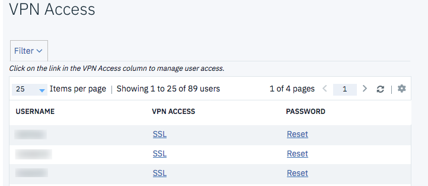
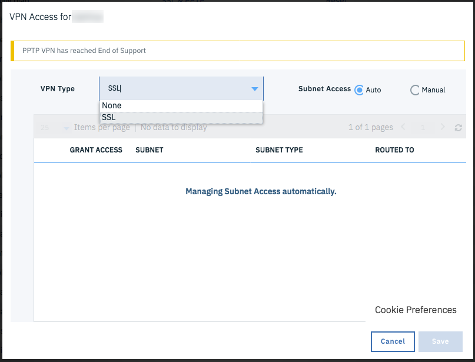

---

copyright:
  years: 1994, 2017-2019
lastupdated: "2019-03-06"

keywords: VPN access, IBM Cloud VPN, user account

subcollection: iaas-vpn

---

{:shortdesc: .shortdesc}
{:new_window: target="_blank"}

{:DomainName: data-hd-keyref="DomainName"}
{:note: .note}
{:important: .important}
{:deprecated: .deprecated}
{:generic: data-hd-programlang="generic"}

# Getting started with Virtual Private Networking (VPN)
{:#gettingstarted-with-virtual-private-networking}

## What is IBM Cloud VPN?
{:#what-is-ibmcloud-vpn}

VPN access enables users to manage all servers remotely and securely over the IBM Cloud private network. A VPN connection from your location to the private network allows out-of-band management and server rescue through an encrypted VPN tunnel. With VPN access, you can:

* Establish a VPN connection to the private network by SSL, or IPSec.
* Access your server through its private 10.x.x.x IP address by SSH or RDP.
* Connect to your server’s IPMI IP address for additional server management or rescue needs.

**PPTP VPN services are deprecated effective June 12, 2018, as described in [our anouncement](/docs/infrastructure/iaas-vpn?topic=VPN-pptp-vpn-deprecation).**
{:deprecated}

A number of services require access through the private network, and the VPN is one method that allows private network access. A VPN is good to use when you need to log in to the private network, do your work, and then log out. For example, this access often is needed to reach the KVM of the server.

Each user account can be given VPN access and can be limited regarding the subnets to which it needs access. You must have VPN access enabled and you must create a VPN password before you can log in to the VPN.

## Enable each user's VPN access
{:#enable-user-vpn-access}

To get started, you'll need to enable VPN access on each account that needs VPN access. Every account starts with VPN access **disabled**, including your team's master account. To enable VPN access, follow these steps:

1. Go to **Account -> VPN Access** in the [Customer Portal ](https://control.softlayer.com/).
* There you'll find the row for each possible VPN user and a link under the **VPN Access** column.
* The link will read "None" if the user does not yet have VPN access enabled.
* If the user's VPN access link reads **SSL**, that means that the user already has had their VPN access enabled.

1. To enable or change the VPN access types permitted for a specific user, click the link under the **VPN Access** column.
* In the next page you can enable the VPN access type appropriate for each user.  

## Set the VPN password
{:#set-vpn-password}

Your next step is to create a VPN password. Each user can create and update their VPN password in the [Customer Portal ](https://control.softlayer.com/). To do so, select your name at the top right, which takes you to the **Edit profile** page. You can also select **Account -> Users** and then select your user name.

      Note: The link reads "Master User". This link will read your name for sub users.

On the **Edit User Profile** page, just scroll down and initialize or update the VPN password.

## Log in to the VPN
{:#login-to-the-vpn}

Now that the VPN access has been established, you can log in.

1. To log into the SSL VPN, visit [vpn.softlayer.com](https://vpn.softlayer.com/) and select any of the login points. You can use any VPN access point, and you are given the same access permissions to the private network in all the datacenters.
* If you have trouble logging into one location, try another location.
* Alternatively, you can log in using a standalone client SSL VPN.
