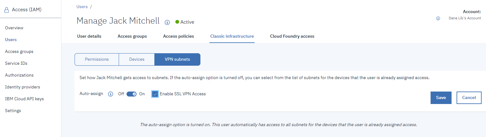
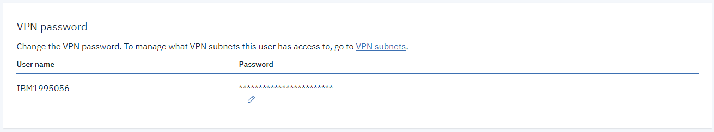

---

copyright:
  years: 1994, 2021
lastupdated: "2021-06-21"

keywords: VPN access, IBM Cloud VPN, user account

subcollection: iaas-vpn

---

{:shortdesc: .shortdesc}
{:new_window: target="_blank"}
{:codeblock: .codeblock}
{:pre: .pre}
{:screen: .screen}
{:term: .term}
{:tip: .tip}
{:note: .note}
{:important: .important}
{:deprecated: .deprecated}
{:external: target="_blank" .external}
{:generic: data-hd-programlang="generic"}
{:download: .download}
{:DomainName: data-hd-keyref="DomainName"}
{:term: .term}

# Getting started with {{site.data.keyword.cloud_notm}} Virtual Private Networking
{: #getting-started}

Virtual Private Networking (VPN) access enables users to manage all servers remotely and securely over the {{site.data.keyword.cloud}} private network. A VPN connection from your location to the private network allows out-of-band management and server rescue through an encrypted VPN tunnel. VPN tunnels can be initiated to any IBM Cloud data center or PoP allowing you geographic redundancy.
{: shortdesc}

With VPN access, you can:

* Establish a VPN connection to the private network via SSL, or IPsec.
* Access your server through its primary private IP address by SSH or RDP.
* Connect to your server’s IPMI IP address for low-level server management or rescue needs.

A number of services require access through the private network, and VPN is one method that allows private network access. A VPN is good to use when you need to log in to the private network, do your work, and then log out. For example, this access often is needed to reach the KVM of the server.

Each user on an account can be given VPN access and can be limited regarding the subnets to which it needs access. The account user must have VPN access enabled and a VPN password specified before attempting to log in to VPN services.

SSL VPN is a shared VPN service, which is free of charge. It is not recommended for production use.
{: important}

## Use case scenarios
{: #use-case-scenarios}

| If you plan to: | Recommended VPN option:  |
|--------------|--------------|
| Access your server on classic through its private IP address (`10.x.x.x`) by SSH or RDP for a short duration  \n Perform low-level server management with the KVM console of your classic server  \n Apply critical security updates to your server with public interface shut down  \n Establish a single person, short-lived, private network connection for occasional server and application management | SSL VPN |
| Manage multiple servers for development or test workloads on classic through an encrypted VPN tunnel  \n Transfer large files regularly among different servers  \n Establish a long-lived network path for managing servers and the customer-deployed applications they host | IPsec VPN |
| Establish a site-to-site SSL or IPsec VPN connection between IBM Cloud and on-premises for unlimited SSL VPN users and production workload  \n Establish a site-to-site SSL or IPsec VPN connection between two on-premise enterprise data centers for unlimited SSL VPN users | VPN gateway appliances on classic (for example, Juniper vSRX or AT&T vRouter) |

## Enabling SSL VPN access
{: #enable-user-vpn-access}

To get started, you'll need to enable VPN access on each account that needs VPN access. To enable SSL VPN access, follow these steps:

1. Log in to the [{{site.data.keyword.cloud_notm}} console](https://{DomainName}/){: external}.
1. Click **Manage > Access (IAM)**, and select **Users**.

   To add a user, click **Add VPN-only user** or **Invite users**. For more information, see [Inviting users to an account](/docs/iam?topic=iam-iamuserinv){: external}.
   {: note}

1. Select the name of the user that you want to assign SSL VPN access.
1. From the Manage _User_ page, select the **Classic Infrastructure** tab and then click **VPN subnets**.
1. Select the **Enable SSL VPN Access** checkbox and click **Save**.

   For example:

   

## Setting the VPN password
{: #set-vpn-password}

Your next step is to update the classic infrastructure VPN password. You can update your own VPN password, or in the case where a user forgets their password, another user with correct access can update that user's VPN password.

If you have the following access, you can update the VPN password for another user:

* An IAM policy with the Editor or higher role on the User management service.
* You are an ancestor in the classic infrastructure hierarchy for the user and you have the Manage users classic infrastructure permission assigned.

To update the VPN password:

1. From the {{site.data.keyword.cloud_notm}} menu bar, click **Manage > Access (IAM)**, and select **Users**.
2. Select a user from the list.
3. From the User details view, go to the **VPN password** section.

   

4. Click the **Edit** icon  to enter a new VPN password.  
5. Click **Apply** to save your changes.

## Logging in to the VPN
{: #login-to-the-vpn}

Now that the VPN access is configured, you can log in using your browser.

1. Open your web browser and click on any one of the [available VPN endpoints](https://www.ibm.com/cloud/vpn-access){: external}.

   Supported operating systems and browser pairs are as follows:

      * Vista/Win7/Win8/Win10/Win2003/Win2008: Chrome, 360SE, MSIE, Firefox
      * Linux: Chrome, Firefox
      * MacOS: Safari, Chrome

2. When prompted, enter the VPN login credentials that you configured in [Setting the VPN password](#set-vpn-password).

   * If you have a stand-alone MotionPro client installed, your client is launched automatically. 
   * If you do not have a client installed, the compatible version of the MotionPro client is available for you to download. 
3. With the MotionPro client, dependent on your operating system, you can follow different steps to create a connection. For more information about connecting using a MotionPro client, see [Stand-alone clients](/docs/iaas-vpn?topic=iaas-vpn-standalone-vpn-clients).
