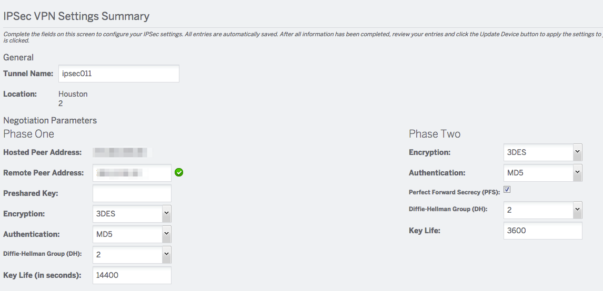

---
copyright:
  years: 1994, 2017
lastupdated: "2017-11-01"
---

{:shortdesc: .shortdesc}
{:new_window: target="_blank"}

# IPsec-VPN einrichten

## Was ist IPsec-VPN? 

IPsec ist eine Protokollgruppe zur Authentifizierung und Verschlüsselung des gesamten IP-Datenverkehrs zwischen zwei Standorten mithilfe eines Tunnelungsmodus, wodurch ein verschlüsseltes Netz zwischen zwei Sites entsteht. Es ermöglicht das Übertragen vertrauenswürdiger Daten über Netze, die sonst als nicht sicher angesehen werden würden. Weitere allgemeine Informationen zu IPsec finden Sie in der [Referenzliteratur](external-reference.html).

Der Zugriff auf das VPN von IBM Cloud ermöglicht den Benutzern, alle Server remote und sicher über das private Netz von IBM Cloud zu verwalten. Die VPN-Verbindung von Ihrem Standort zum privaten Netz ermöglicht Out-of-band-Management und Serverrettung über einen verschlüsselten VPN-Tunnel. Mit VPN-Zugriff verfügen Sie über folgende Möglichkeiten:

   - Erstellen einer VPN-Verbindung zu einem privaten Netz über SSL, PPTP oder IPsec
   - Zugriff auf den Server unter Verwendung der privaten IP-Adresse 10.x.x.x über SSH oder RDP
   - Verbindung zur IPMI-IP-Adresse des Servers für zusätzliche Serververwaltung oder Rettungszwecke

Der IPsec-Service wird den Kunden zur Verwaltung ihrer Umgebungen bereitgestellt. Die Verwendung für den Produktionsbetrieb wird nicht empfohlen.

## IPsec-Verbindung einrichten

### Verhandlungsparameter

Sie müssen über die folgenden Informationen der fernen Seite des IPsec-VPN verfügen:
- Statische IP-Adresse für VPN-Endpunkt
- Vorab verteilter Schlüssel (Kennwort)
- Verschlüsselungsalgorithmus (DES, 3DES, AES128, AES192, AES256)
- Authentifizierung (MD5, SHA1, SHA256, für Phase 1&2)
- Diffie-Hellman-Gruppe (für Phase 1&2)
- Wird absolute vorwärts gerichtete Sicherheit (Perfect Forward Secrecy, PFS) verwendet?
- Schlüssellebenszykluszeit (für Phase 1 & 2) - **HINWEIS:** Dieser Wert wird vom System in Sekunden gemessen.

Sobald Sie über diese Informationen verfügen, können Sie die grundlegenden Verhandlungsparameter der VPN-Verbindung konfigurieren.

### Geschützte Netze

In den VPN-Verbindungseigenschaften müssen Sie die Netze am fernen Ende des Tunnels sowie die lokalen Netze für den Tunnel definieren. Geben Sie für das geschützte (ferne) Kundenteilnetz ('Protected Customer (Remote) Subnet') den privaten Adressraum in CIDR-Notation für das ferne Ende (des anderen Anbieters) für den IPsec-Tunnel ein.

Beispiel: Falls das Netz am fernen Ende des Tunnels das Einzelteilnetz 10.0.0.0 mit der Netzmaske 255.255.255.0 verwendet, geben Sie die IP-Adresse 10.0.0.0 / CIDR 24 für den Abschnitt 'Protected Customer (Remote) Subnet' ein.

### Netzadressumsetzung (Network Address Translation, NAT)

Bei Verwendung von IPsec-VPN können Sie auch private IP-Adressen für das {{site.data.keyword.BluSoftlayer_notm}}-Netz erstellen, von denen der Datenverkehr zu fernen Teilnetzen am anderen Ende der VPN-Verbindung gesendet wird. So können Sie privaten Internetdatenverkehr an eine interne IP-Adresse an eine Maschine hinter dem VPN weiterleiten, ohne den fernen Standort dem gesamten Internet verfügbar zu machen.  

### Netzadressumsetzung/Zugeordnete statische NAT-Teilnetze

Gehen Sie wie folgt vor, um ein fernes VPN mit einem statischen Eintrag für Netzadressumsetzung (NAT) zu konfigurieren: 

 * Wählen Sie den roten Pfeil aus, damit die Teilnetzliste im Abschnitt **Zugeordnete statische NAT-Teilnetze** angezeigt wird. Jede IP im Teilnetz wird angezeigt.  
 * Geben Sie die IP am fernen Ende der VPN-Verbindung unter der Spalte **Kunden-IP** ein und geben Sie den Namen für die Zuordnung unter der Spalte **Name** ein.  
 * Wählen Sie **Kontextadressumsetzungen hinzufügen/ändern** und **Konfigurationen anwenden** aus, um die Konfiguration zu speichern und anzuwenden.
 
Durch diese Aktion wird eine statische 1:1-Netzumsetzung für den zurückfließenden Datenverkehr konfiguriert, der von den Hosts hinter dem IBM Cloud-VPN-Konzentrator zum Kommunizieren mit den Hosts hinter dem fernen VPN-Peer verwendet wird. Beispiel: Der gesamte Verkehr für die IP-Adresse 10.1.255.92 wird umgesetzt und an die IP-Adresse 192.168.10.15 des Kunden weitergeleitet. Aufgrund der Weiterleitung sind keine weiteren Routeneinträge auf dem IBM Cloud-Server erforderlich. 
