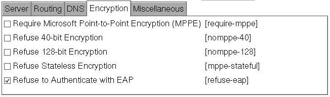

---
copyright:
  years: 1994, 2017
lastupdated: "2017-12-01"
---

{:shortdesc: .shortdesc}
{:new_window: target="_blank"}

# PPTP für Fedora Core 5 konfigurieren

Die Installation und Konfiguration muss durchgeführt werden.

**1. Installation**
Installieren Sie die grafische Benutzerschnittstelle `pptpconfig` mit einem der folgenden Befehle:
```
# rpm -Uvh http://pptpclient.sourceforge.net/yum/stable/fc5/pptp-release-current.no...
# yum --enablerepo=pptp-stable install pptpconfig
```

**2. Konfiguration**

1. IBM Cloud-PPTP-Informationen:
<table><tr><td>Server:</td><td>pptpvpn.dal01.softlayer.com (Dallas)<br/>pptpvpn.sea01.softlayer.com (Seattle)<br/>pptpvpn.wdc01.softlayer.com (Washington D.C.)</td></tr><tr><td>Domänenname:</td><td>Leer lassen</td></tr><tr><td>Benutzername:</td><td>(Beispiel: SL12345)</td></tr><tr><td>Kennwort:</td><td>&nbsp;</td></tr></table>

2. Führen Sie *pptpconfig* <span style="text-decoration: underline">als Root</span> aus; ein Fenster wird angezeigt.<br/>


3. Geben Sie Name, Server, Benutzername und Kennwort in die Registerkarte für den Server ein.

4. Übernehmen Sie im Abschnitt für die Verschlüsselung die Standardeinstellungen, da diese für die meisten Kunden funktionieren.<br/>


5. Klicken Sie auf *Hinzufügen*; der Tunnel wird in der Liste angezeigt.

6. Klicken Sie auf den Tunnel, um ihn auszuwählen, und klicken Sie auf *Start*; ein Fenster mit Protokollverbindung und -status des Tunnels wird angezeigt. 

7. Wenn Die Verbindung fehlschlägt, kann es nötig sein, weitere Informationen zu erfassen; klicken Sie dazu auf die Registerkarte *Sonstiges*, auf *Debugfunktionen für Verbindung aktivieren* klicken Sie danach auf *Aktualisieren* und versuchen Sie erneut *Start*. Unter [Vorgehensweise für Diagnose](http://pptpclient.sourceforge.net/howto-diagnosis.phtml){:new_window} wird dann angezeigt, um welchen Fehler es sich handelt.<br/>


8. Wenn die Verbindung erfolgreich ist, können Sie die Schaltfläche für den Pingtest erneut versuchen. Falls das Pingsignal fehlschlägt, müssen Sie die Ursache suchen, bevor Sie fortfahren können. Wenn das Pingsignal funktioniert, ist der Tunnel aktiv und Sie können mit der Weiterleitung arbeiten.

9. Nur die IPs, die auf dem Back-End in IBM Cloud verwendet werden, müssen durch diesen VPN-Tunnel geroutet werden. *Stoppen* Sie den Tunnel, wählen Sie ihn erneut aus, klicken Sie entweder auf *Client zu LAN oder LAN zu LAN* auf der Registerkarte *Weiterleitung* und verwenden Sie die Registerkarte *Netzrouten weiterleiten* zum Eingeben von '10.0.0.0/8' für das Netz und 'SoftLayer' für den Namen; versuchen Sie anschließend erneut *Start*. Versuchen Sie jetzt, auf die private IP-Adresse des Servers oder die private Namensserveradresse von SoftLayer unter 10.0.80.11 zuzugreifen.<br/>

