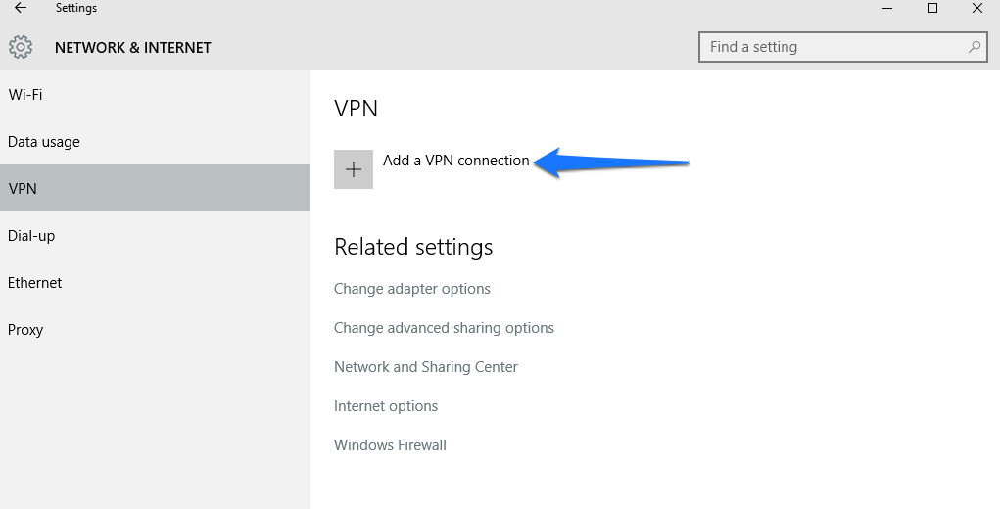

---
copyright:
  years: 1994, 2017
lastupdated: "2017-12-01"
---

{:shortdesc: .shortdesc}
{:new_window: target="_blank"}

# Configurar la VPN con PPTP en Windows 10

1. Inicie la aplicación **Valores** desde el menú **Inicio** y pulse **Red e Internet**.

2. En la parte izquierda del panel **Red e Internet**, seleccione **VPN** y en la página siguiente, seleccione **Añadir una conexión VPN**.



3. En la página siguiente configurará la conexión VPN con PPTP. Estos son los valores:

 * _Proveedor VPN:_ Windows (incorporado)
 * _Conexión:_ Debe proporcionar un nombre para esta conexión, por ejemplo `MyPPTP`.
 * _Nombre de servidor o dirección:_ Escriba el nombre del servidor que desea alcanzar. (Por ejemplo, `pptpvpn.dal01.softlayer.com`)
 * _Tipo de VPN:_ Seleccione "PPTP (Point to Point Tunneling Protocol)"
 *_ Tipo de inicio de sesión:_ Seleccione "Nombre de usuario y contraseña"
  * Ahora escriba el nombre de usuario y contraseña de la VPN
  * Vuelva a comprobar todos los datos seleccionados y pulse **Guardar**


4. Cuando vuelva a la página principal de VPN, seleccione la conexión `MyPPTP` (que ha creado anteriormente) para conectarse.


5. Para utilizar Internet mientras está conectado, debe inhabilitar la pasarela remota; puede hacerlo mediante Powershell.

 * Abra PowerShell pulsando con el botón derecho y seleccionando **Ejecutar como administrador**
 * Escriba los mandatos siguientes:
 ```
`Get-VpnConnection`
`Set-VpnConnection -Name "MyPPTP" -SplitTunneling $True`
```
