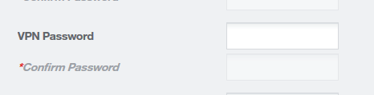

---

copyright:
  years: 1994, 2017-2019
lastupdated: "2019-03-06"

keywords: VPN access, IBM Cloud VPN, user account

subcollection: iaas-vpn

---

{:shortdesc: .shortdesc}
{:new_window: target="_blank"}

{:DomainName: data-hd-keyref="DomainName"}
{:note: .note}
{:important: .important}
{:deprecated: .deprecated}
{:generic: data-hd-programlang="generic"}

# Initiation au VPN (Virtual Private Networking)
{:#gettingstarted-with-virtual-private-networking}

## Qu'est-ce que le VPN IBM Cloud ?
{:#what-is-ibmcloud-vpn}

L'accès VPN permet aux utilisateurs de gérer à distance tous les serveurs en toute sécurité via le réseau privé d'IBM Cloud. Une connexion VPN depuis votre emplacement vers le réseau privé permet la gestion externe et la récupération des serveurs via un tunnel VPN chiffré. Avec l'accès au VPN, vous pouvez :

* Etablir une connexion VPN au réseau privé à l'aide de SSL, ou IPSec.
* Accéder sous SSH ou RDP à votre serveur en utilisant son adresse IP privée 10.x.x.x.
* Etablir une connexion à l'adresse IP IPMI de votre serveur à des fins de récupération ou de gestion de serveur supplémentaires.

**Les services VPN PPTP seront obsolètes à partir du 12 juin 2018, comme décrit dans notre [notification](/docs/infrastructure/iaas-vpn?topic=VPN-pptp-vpn-deprecation).**
{:deprecated}

Un certain nombre de services nécessitent un accès via le réseau privé et le VPN permet d'accéder au réseau privé. Un VPN est parfaitement approprié lorsque vous avez besoin de vous connecter au réseau privé, d'effectuer un travail, puis de vous déconnecter. Ainsi, cet accès est souvent nécessaire pour atteindre le serveur de machine virtuelle multinoyaux.

Chaque compte utilisateur peut recevoir un accès VPN et être limité aux sous-réseaux auxquels il doit accéder. L'accès VPN doit être activé et vous devez créer un mot de passe VPN pour pouvoir vous connecter au VPN.

## Activation de l'accès VPN de chaque utilisateur
{:#enable-user-vpn-access}

Pour commencer, vous devez activer l'accès VPN pour chaque compte ayant besoin d'un accès VPN. Les comptes démarrent tous avec l'accès VPN **désactivé**, y compris le compte principal de l'équipe. Pour activer l'accès VPN, procédez comme suit :

1. Accédez à **Compte -> Accès VPN** dans le [Portail client ](https://control.softlayer.com/).
* Vous y trouverez une ligne pour chaque utilisateur VPN possible ainsi qu'un lien sous la colonne **Accès VPN**.
* Ce lien affiche "Aucun" si aucun accès VPN n'est activé pour l'utilisateur.
* Si le lien d'accès au VPN de l'utilisateur indique **SSL**, cela signifie qu'un accès VPN est déjà activé pour l'utilisateur.

1. Pour activer ou modifier le type d'accès au VPN d'un utilisateur spécifique, cliquez sur le lien sous la colonne **Accès VPN**.
* Dans la page suivante, vous pouvez activer le type d'accès au VPN approprié à chaque utilisateur.  

## Définition du mot de passe VPN
{:#set-vpn-password}

L'étape suivante consiste à créer un mot de passe VPN. Chaque utilisateur peut créer et mettre à jour son mot de passe VPN dans le [Portail client ](https://control.softlayer.com/). Pour ce faire, sélectionnez votre nom en haut à droite pour accéder à la page de **modification du profil**. Vous pouvez également sélectionner **Compte -> Utilisateurs**, puis sélectionner votre nom d'utilisateur.

      Remarque : le lien affiche "Utilisateur principal". Ce lien affichera votre nom pour les utilisateurs secondaires.

Sur la page **Modifier profil utilisateur**, faites défiler vers le bas et initialisez ou mettez à jour le mot de passe VPN.

## Connexion au VPN
{:#login-to-the-vpn}

Maintenant que l'accès au VPN a été défini, vous pouvez vous connecter.

1. Pour vous connecter au VPN SSL, rendez-vous sur le site [vpn.softlayer.com](https://vpn.softlayer.com/) et sélectionnez l'un des points de connexion. Vous pouvez utiliser n'importe quel point d'accès VPN et vous disposez des mêmes droits d'accès au réseau privé dans tous les centres de données.
* En cas de problème de connexion à l'un des sites, vous pouvez en essayer un autre.
* De même, vous pouvez vous connecter en utilisant un VPN SSL de client autonome.
