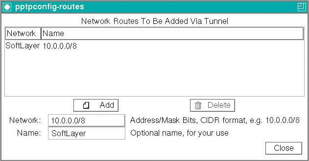

---
copyright:
  years: 1994, 2017
lastupdated: "2017-12-01"
---

{:shortdesc: .shortdesc}
{:new_window: target="_blank"}

# Configuração de PPTP para Fedora Core 5

Você precisará instalar e configurar.

**1. Instalação** Instale o PPTP e a GUI `pptpconfig` usando um dos seguintes comandos:
```
# rpm -Uvh http://pptpclient.sourceforge.net/yum/stable/fc5/pptp-release-current.no...
# yum --enablerepo=pptp-stable install pptpconfig
```

**2. Configuração**

1. Informações de PPTP do IBM Cloud:
<table><tr><td>Servidor:</td><td>pptpvpn.dal01.softlayer.com (Dallas)<br/>pptpvpn.sea01.softlayer.com (Seattle)<br/>pptpvpn.wdc01.softlayer.com (Washington D.C.)</td></tr><tr><td>
Nome de domínio:</td><td>Deixar em branco</td></tr><tr><td>Nome do usuário:</td><td>(exemplo: SL12345)</td></tr><tr><td>Senha:</td><td>&nbsp;</td></tr></table>

2. Execute *pptpconfig* <span style="text-decoration: underline">como root</span> e uma janela deve aparecer.<br/>


3. Insira o nome, o servidor, o nome de usuário e a senha na guia Servidor.

4. Na seção Criptografia deixe tudo com o padrão para que funcione para a maioria dos clientes.<br/>


5. Clique em *Incluir* e o túnel aparecerá na lista,

6. Clique no túnel para selecioná-lo, clique em *Iniciar* e uma janela aparecerá com o log e o status da
conexão de túnel,

7. Se a conexão falhar, você pode precisar reunir mais informações, portanto, na guia *Diversos*, clique em
*Ativar instalações de depuração de conexão*, clique em *Atualizar*, tente *Iniciar*
novamente e, então, olhe para o [Instruções de diagnóstico](http://pptpclient.sourceforge.net/howto-diagnosis.phtml){:new_window} para qualquer erro que seja exibido.<br/>


8. Se a conexão for bem-sucedida, tente o botão de teste de ping. Se o ping falhar, tente descobrir o motivo antes de continuar. Se o ping funcionar, então, o túnel estará ativo e agora você poderá trabalhar no roteamento.

9. Somente os IPs que existem na rede de backend no IBM Cloud devem ser roteados por meio desse túnel VPN.  
*Pare* o túnel, selecione-o outra vez e, em seguida, clique em *Cliente para LAN ou LAN para LAN* na guia
*Roteamento*, use o botão *Editar rotas de rede* para inserir '10.0.0.0/8' para a Rede e 'SoftLayer'
para o Nome e, em seguida, tente *Iniciar* novamente. Agora tente acessar o endereço IP privado do seu servidor ou o
servidor de nomes privados do SoftLayer em 10.0.80.11.<br/>

