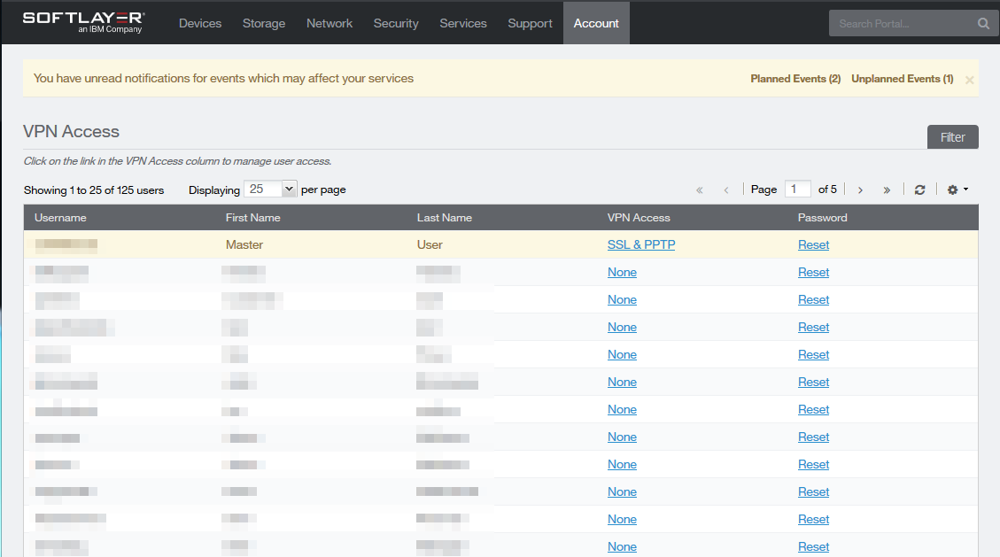

---

copyright:
  years: 1994, 2017-2019
lastupdated: "2019-03-06"

keywords: VPN access, IBM Cloud VPN, user account

subcollection: iaas-vpn

---

{:shortdesc: .shortdesc}
{:new_window: target="_blank"}

{:DomainName: data-hd-keyref="DomainName"}
{:note: .note}
{:important: .important}
{:deprecated: .deprecated}
{:generic: data-hd-programlang="generic"}

# 虚拟专用网 (VPN) 入门
{:#gettingstarted-with-virtual-private-networking}

## 什么是 IBM Cloud VPN？
{:#what-is-ibmcloud-vpn}

通过 VPN 访问，用户可以使用 IBM Cloud 专用网络来远程安全地管理所有服务器。通过建立从您的位置到专用网络的 VPN 连接，便可以使用加密的 VPN 隧道进行带外管理和服务器急救。通过 VPN 访问，您可以：

* 通过 SSL 或 IPSec 建立与专用网络的 VPN 连接。
* 使用 SSH 或 RDP 通过服务器的专用 10.x.x.x IP 地址来访问服务器。
* 连接到服务器的 IPMI IP 地址以满足其他服务器管理或急救需求。

**自 2018 年 6 月 12 日起已弃用 PPTP VPN 服务，相关说明请参阅[我们的公告](/docs/infrastructure/iaas-vpn?topic=VPN-pptp-vpn-deprecation)。**
{:deprecated}

有若干服务需要通过专用网络进行访问，而 VPN 正是一种允许访问专用网络的方法。当您需要登录到专用网络，执行工作，然后注销时，最好使用 VPN。例如，访问服务器的 KVM 通常需要此访问权。

可以为每个用户帐户授予 VPN 访问权，并且可以限制该帐户需要访问的子网。您必须启用 VPN 访问，并且必须创建 VPN 密码后，才能登录到 VPN。

## 启用每个用户的 VPN 访问
{:#enable-user-vpn-access}

首先，您应在需要 VPN 访问的每个帐户上启用 VPN 访问。每个帐户的 VPN 访问一开始都为**已禁用**，包括您团队的主帐户。要启用 VPN 访问，请执行以下步骤：

1. 转至[客户门户网站 ](https://control.softlayer.com/) 中的**帐户 -> VPN 访问**。
* 在 **VPN 访问**列下，可以找到每个可能的 VPN 用户所在的行以及链接。
* 如果用户尚未启用 VPN 访问，那么该链接将显示“无”。
* 如果用户的 VPN 访问链接显示 **SSL**，那么表示用户的 VPN 访问已启用。

1. 要启用或更改特定用户允许的 VPN 访问类型，请单击 **VPN 访问**列下的链接。
* 在接下来出现的页面中，可以为每个用户启用相应的 VPN 访问类型。  

## 设置 VPN 密码
{:#set-vpn-password}

下一步是创建 VPN 密码。每个用户都可以在[客户门户网站 ](https://control.softlayer.com/) 中创建和更新自己的 VPN 密码。要执行此操作，请选择右上角您的名称，这将转至**编辑概要文件**页面。您还可以选择**帐户 -> 用户**，然后选择您的用户名。

      注：链接显示的是“主用户”。对于子用户，此链接将显示您的用户名。

在**编辑用户概要文件**页面上，只需向下滚动并初始化或更新 VPN 密码即可。

## 登录到 VPN
{:#login-to-the-vpn}

现在已建立了 VPN 访问，您可以进行登录。

1. 要登录到 SSL VPN，请访问 [vpn.softlayer.com](https://vpn.softlayer.com/) 并选择任一登录点。您可以使用任何 VPN 访问点，并且会授予您对所有数据中心的专用网络的相同访问许可权。
* 如果在登录到某个位置时发生问题，请尝试其他位置。
* 或者，您可以使用独立客户机 SSL VPN 进行登录。
