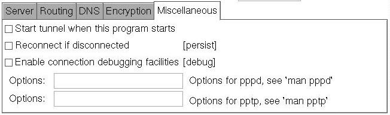

---
copyright:
  years: 1994, 2017
lastupdated: "2017-12-01"
---

{:shortdesc: .shortdesc}
{:new_window: target="_blank"}

# 针对 Fedora Core 5 设置 PPTP

您需要进行安装和配置。

**1. 安装**
使用以下其中一个命令来安装 PPTP 和 `pptpconfig` GUI：
```
# rpm -Uvh http://pptpclient.sourceforge.net/yum/stable/fc5/pptp-release-current.no...
# yum --enablerepo=pptp-stable install pptpconfig
```

**2. 配置**

1. IBM Cloud PPTP 信息：
<table><tr><td>服务器：</td><td>pptpvpn.dal01.softlayer.com（达拉斯）<br/>pptpvpn.sea01.softlayer.com（西雅图）<br/>pptpvpn.wdc01.softlayer.com（华盛顿特区）</td></tr><tr><td>域名：</td><td>保留为空白</td></tr><tr><td>用户名：</td><td>（示例：SL12345）</td></tr><tr><td>密码：</td><td>&nbsp;</td></tr></table>

2. 以 <span style="text-decoration: underline">root 用户身份</span>运行 *pptpconfig*，这应该会显示一个窗口，<br/>


3. 在“服务器”选项卡中，输入名称、服务器、用户名和密码。

4. 在“加密”部分中，保留所有缺省值以便适用于大多数客户。<br/>


5. 单击*添加*，然后隧道将显示在列表中，

6. 单击以选择隧道，单击*启动*，这将显示一个窗口，其中包含隧道连接日志和状态。

7. 如果连接失败，您可能需要收集更多信息。为此，在*其他*选项卡上，单击*启用连接调试工具*，单击*更新*，重试*启动*，然后查看 [Diagnosis HOWTO](http://pptpclient.sourceforge.net/howto-diagnosis.phtml){:new_window} 以了解显示的任何错误。<br/>


8. 如果连接成功，那么可以尝试“Ping 测试”按钮。如果 ping 操作失败，您应该尝试找出原因后再继续。如果 ping 操作正常执行，说明隧道处于活动状态，您现在可以正常使用路由。

9. 只有位于 IBM Cloud 的后端网络中的有效 IP 才应该通过此 VPN 隧道进行路由。*停止*隧道，再次选择该隧道，然后单击*路由*选项卡上的*“客户机到 LAN”或“LAN 到 LAN”*，使用*编辑网络路径*按钮为“网络”输入“10.0.0.0/8”，为“名称”输入“SoftLayer”，然后重试*启动*。现在，请尝试访问服务器的专用 IP 地址或位于 10.0.80.11 的 SoftLayer 专用名称服务器。<br/>

