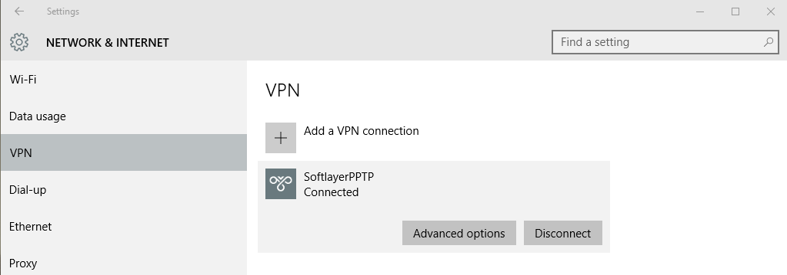

---
copyright:
  years: 1994, 2017
lastupdated: "2017-12-01"
---

{:shortdesc: .shortdesc}
{:new_window: target="_blank"}

# 在 Windows 10 中设置 PPTP VPN

1. 从**开始**菜单启动**设置**应用程序，然后单击**网络和 Internet**。

2. 在**网络和 Internet** 面板的左侧，选择 **VPN**，然后在下一个页面中，选择**添加 VPN 连接**。


3. 在后一个页面上，将设置 PPTP VPN 连接。具体设置如下：

 * _VPN 提供商：_Windows（内置）
 * _连接：_必须为此连接提供名称，例如 `MyPPTP`。
 * _服务器名称或地址：_输入要访问的服务器的名称。（例如，`pptpvpn.dal01.softlayer.com`）
 * _VPN 类型：_选择“点到点隧道协议”(PPTP)
*_登录类型：_选择“用户名和密码”
  * 现在输入您的 VPN 用户名和密码
  * 再次检查所有所选数据，然后按**保存**


4. 返回到主 VPN 页面后，选择（您先前创建的）`MyPPTP` 连接以进行连接。



5. 要在连接时使用因特网，必须禁用远程网关，这可通过 PowerShell 来执行。

 * 通过右键单击 PowerShell 并选择**以管理员身份运行**来打开 PowerShell
 * 输入以下命令：
 ```
`Get-VpnConnection`
`Set-VpnConnection -Name "MyPPTP" -SplitTunneling $True`
```
