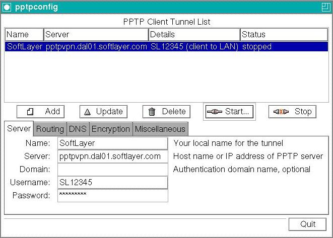

---
copyright:
  years: 1994, 2017
lastupdated: "2017-12-01"
---

{:shortdesc: .shortdesc}
{:new_window: target="_blank"}

# 設定 Fedora Core 5 的 PPTP

您需要安裝並配置。

**1. 安裝**
使用下列其中一個指令來安裝 PPTP 及 `pptpconfig` GUI：
```
# rpm -Uvh http://pptpclient.sourceforge.net/yum/stable/fc5/pptp-release-current.no...
# yum --enablerepo=pptp-stable install pptpconfig
```

**2. 配置**

1. IBM Cloud PPTP 資訊：
<table><tr><td>伺服器：</td><td>pptpvpn.dal01.softlayer.com（達拉斯）<br/>pptpvpn.sea01.softlayer.com（西雅圖）<br/>pptpvpn.wdc01.softlayer.com（華盛頓特區）</td></tr><tr><td>網域名稱：</td><td>保留空白</td></tr><tr><td>使用者名稱：</td><td>（範例：SL12345）</td></tr><tr><td>密碼：</td><td>&nbsp;</td></tr></table>

2. <span style="text-decoration: underline">以 root 使用者身分</span>執行 *pptpconfig*，隨即應該會出現一個視窗。<br/>


3. 在 Server 標籤中，輸入名稱、伺服器、使用者名稱及密碼。

4. 在 Encryption 區段中，保留所有項目的預設值，因為這對大部分客戶而言可以運作。<br/>


5. 按一下 *Add*，通道將出現在清單中。

6. 按一下通道選取它，按一下 *Start*，隨即會出現具有通道連線日誌和狀態的視窗。

7. 如果連線失敗，您可能需要收集更多資訊，因此請在 *Miscellaneous* 標籤上按一下 *Enable connection debugging facilities*，再按一下 *Update*、重試 *Start*，然後查看 [Diagnosis HOWTO](http://pptpclient.sourceforge.net/howto-diagnosis.phtml){:new_window} 以瞭解顯示的任何錯誤。<br/>


8. 如果連線成功，您可以嘗試 Ping test 按鈕。如果連線測試失敗，您應該嘗試找出原因然後才繼續。如果連線測試正常，則通道在作用中，您現在可以進行遞送。

9. 只有位於 IBM Cloud 之後端網路中的 IP 才應透過此 VPN 通道遞送。按 *Stop* 停止通道、再次選取它，然後在 *Routing* 標籤上按一下 *Client to LAN or LAN to LAN*，並使用 *Edit Network Routes* 按鈕，在 Network 中輸入 '10.0.0.0/8'、在 Name 輸入 SoftLayer，然後再次嘗試 *Start*。現在，嘗試存取您伺服器的專用 IP 位址或 SoftLayer 的專用名稱伺服器 10.0.80.11。<br/>

