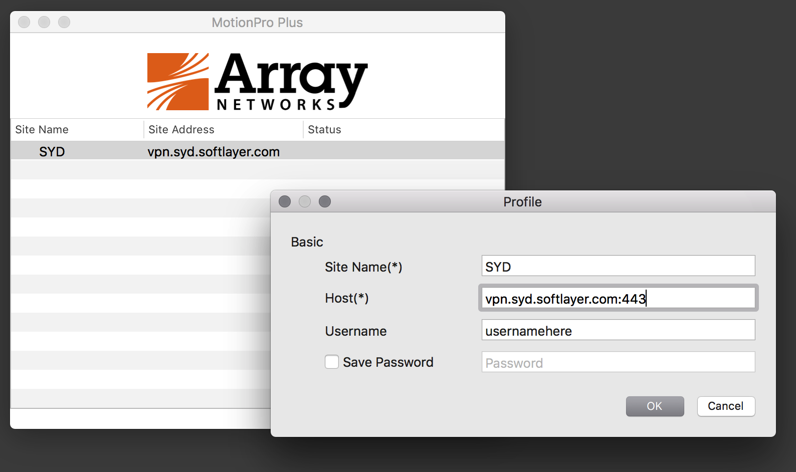

---
copyright:
  years: 1994, 2017
lastupdated: "2017-12-01"
---

{:shortdesc: .shortdesc}
{:new_window: target="_blank"}

# 獨立式 VPN 用戶端 - Windows、Linux 及 Mac OS X

## Windows 獨立式用戶端

Windows (8/7/Vista/XP) 32 位元：https://speedtest.dal05.softlayer.com/array/ArrayMotionProSetup_win32_v1.1.3.zip

Windows (8/7/Vista/XP) 64 位元：https://speedtest.dal05.softlayer.com/array/ArrayMotionProSetup_win64_v1.1.3.zip

1. 視您的作業系統而定，下載上述其中一個檔案。
* 執行 MotionProSetup 來安裝軟體。
* 執行 MotionPro 並在開啟畫面中選取 **Profile -> Add**。
* 透過為設定檔提供網站名稱（從底下的 SSL VPN 網站清單中選擇主機名稱）來建立設定檔。然後輸入您的 VPN 使用者名稱及密碼，再按下 **Save**。
* 最後，按兩下您剛建立的設定檔以連接至 VPN。

**附註**
 * 「網站」可以是網域名稱或 IP 位址。
 * 如果發生問題，請使用「Windows 控制台」來解除安裝任何 Array 程式、重新開機，然後重新連接。
 * 在 Windows 8 RT 上沒有作用。

## Linux 獨立式用戶端

CentOS 64 位元：https://speedtest.dal05.softlayer.com/array/MotionPro_Linux_CentOS_x86-64_1.0.4.sh

Redhat 32 位元：https://speedtest.dal05.softlayer.com/array/MotionPro_Linux_RedHat_x86-32_1.0.4.sh

Redhat 64 位元：https://speedtest.dal05.softlayer.com/array/MotionPro_Linux_RedHat_x86-64_1.0.4.sh

Ubuntu 32 位元：https://speedtest.dal05.softlayer.com/array/MotionPro_Linux_Ubuntu_x86-32_1.0.4.sh

Ubuntu 64 位元：https://speedtest.dal05.softlayer.com/array/MotionPro_Linux_Ubuntu_x86-64_1.0.4.sh

1. 使它成為可執行：`chmod +x MotionPro_Linux_CentOS_x86-64_1.0.4.sh`
* 執行 Script：`./MotionPro_Linux_CentOS_x86-64_1.0.4.sh.`
* 用法：`./MotionPro --host [site] --user [username] --passwd [password]`
* 若要停止它：`[control-c]`

**附註：**  
 * 若要啟動 MotionPro 用戶端，您必須至少輸入 `hostname` 和 `username` 作為引數。
 * 「網站」可以是網域名稱或 IP 位址。

## Mac OS X 10.10 獨立式用戶端

MacOS StandAlone Array SSL VPN Motion Pro Plus 用戶端的步驟：

1. 從 Apple Store 安裝 Motion Pro Plus 用戶端。
* 在 Applications 資料夾下尋找 Motion Pro Plus 用戶端，然後開啟應用程式。
* 按一下 'Profile'，然後按一下 'Add'。
* 填寫 Site Name、Host 和 Username，然後按一下 Ok。
* 按一下左上方的 VPN，然後進行連接。

範例可能如下：

如果通道未正確地將資料流量導向，則可能需要[手動新增路徑](https://discussions.apple.com/thread/2735376)。

*請先解除安裝所有舊版再進行更新。*

## SSL VPN POP（網站）

* vpn.ams01.softlayer.com
* vpn.ams03.softlayer.com
* vpn.dal01.softlayer.com
* vpn.dal05.softlayer.com
* vpn.dal06.softlayer.com
* vpn.dal07.softlayer.com
* vpn.dal09.softlayer.com
* vpn.sea01.softlayer.com
* vpn.wdc01.softlayer.com
* vpn.wdc04.softlayer.com
* vpn.hou02.softlayer.com
* vpn.sjc01.softlayer.com
* vpn.sjc03.softlayer.com
* vpn.sng01.softlayer.com
* vpn.atl01.softlayer.com
* vpn.chi01.softlayer.com
* vpn.den01.softlayer.com
* vpn.lax01.softlayer.com
* vpn.mia01.softlayer.com
* vpn.nyc01.softlayer.com
* vpn.hkg02.softlayer.com
* vpn.lon02.softlayer.com
* vpn.sao01.softlayer.com
* vpn.mil01.softlayer.com
* vpn.mel01.softlayer.com
* vpn.tor01.softlayer.com
* vpn.mex01.softlayer.com
* vpn.fra02.softlayer.com
* vpn.par01.softlayer.com
* vpn.syd01.softlayer.com
* vpn.che01.softlayer.com
* vpn.mon01.softlayer.com
* vpn.tok02.softlayer.com

**請注意：安裝新版本之前，請先解除安裝任何舊版的用戶端。**
