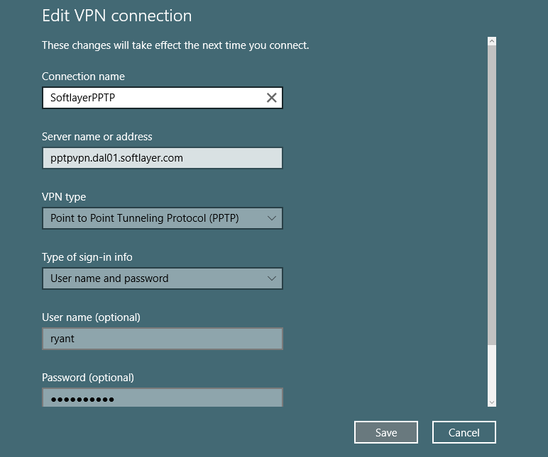

---
copyright:
  years: 1994, 2017
lastupdated: "2017-12-01"
---

{:shortdesc: .shortdesc}
{:new_window: target="_blank"}

# Set up PPTP VPN in Windows 10

1. Launch the **Settings** application from the **Start** menu and click on **Network and Internet**.

2. On the left side of the **Network and Internet** panel, select **VPN** and on the subsequent page, select **Add a VPN Connection**.


3. On the following page you will set up your PPTP VPN connection. Here are the settings:

 * _VPN provider:_ Windows (built-in)
 * _Connection:_ You must give a name to this connection, for example `MyPPTP`.
 * _Server name or address:_ Type the name of the server you want to reach. (For example, `pptpvpn.dal01.softlayer.com`)
 * _VPN type:_ Choose "Point to Point Tunneling Protocol" (PPTP)
 *_ Type of sign-in:_ Choose "User name and password"
  * Now type your VPN username and password
  * Check all selected data once again and press **Save**



4. Once you are back on the main VPN page, select the `MyPPTP` connection (you created earlier) to get connected.


5. To use the internet while connected, you must disable the remote gateway, which can be done through PowerShell.

 * Open PowerShell by Right-clicking on it and selecting **Run As Administrator**
 * Type in the following commands:
 ```
`Get-VpnConnection`
`Set-VpnConnection -Name "MyPPTP" -SplitTunneling $True`
```
