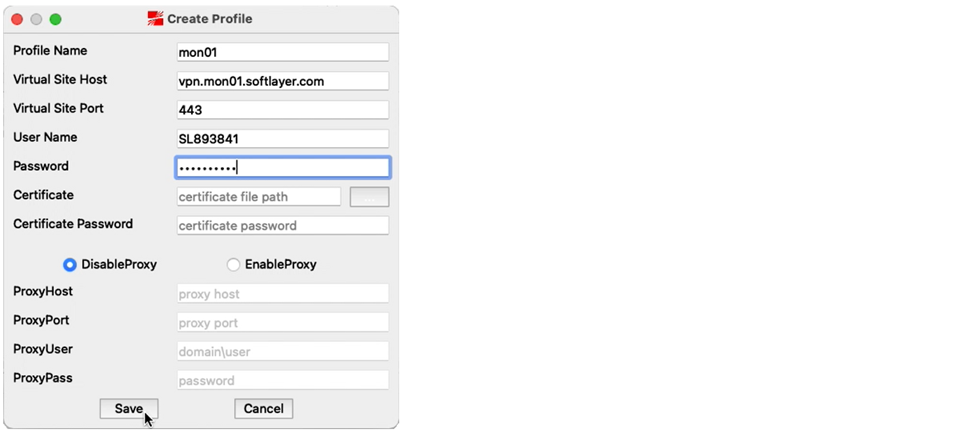
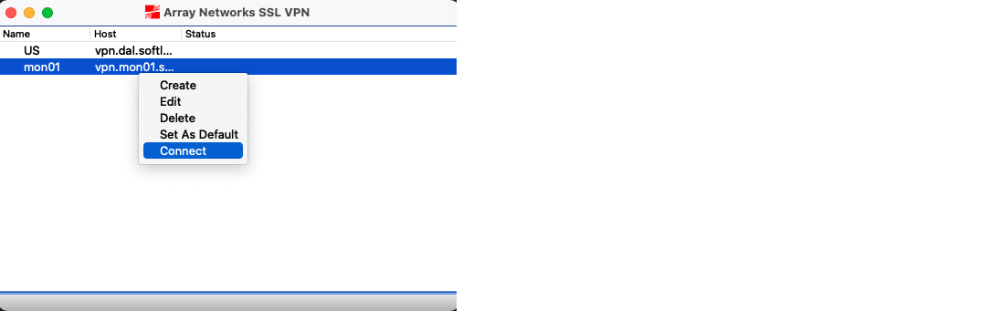

---

copyright:
  years: 1994, 2022
lastupdated: "2022-03-03"

keywords: standalone VPN clients, Virtual Private Network, MotionPro

subcollection: iaas-vpn

---

{{site.data.keyword.attribute-definition-list}}

# Connecting to SSL VPN from MotionPro clients (Windows, Linux, and Mac OS X)
{: #standalone-vpn-clients}

## Prerequisites
{: #standalone-prereqs}

* If you have never installed MotionPro clients, [log in to SSL VPN](/docs/iaas-vpn?topic=iaas-vpn-getting-started#login-to-the-vpn) using the web browser. The compatible version of MotionPro client is available for you to download and install.
* If you already installed a compatible version of the MotionPro client, launch it directly from local.  
* On rare occasions, such as if you have an incompatible browser, you might want to download MotionPro clients manually from the [Array Networks Clients and Tools page](https://support.arraynetworks.net/prx/001/http/supportportal.arraynetworks.net/downloads/downloads.html){:external}. 

Uninstall any previous versions of the client and restart your system before you install a new version.
{: important}

## Windows stand-alone client
{: #windows-standalone-client}

To install and set up MotionPro on Windows, follow these steps:

1. Run the MotionPro Setup Wizard. Then, click the MotionPro icon on your desktop and select **Profile > Add**.
1. To create a profile, enter a Site Name (domain name or IP address) and Host (select from available [VPN endpoints](/docs/iaas-vpn?topic=iaas-vpn-available-vpn-endpoints)). Next, enter your VPN username and password and click **Save**.
1. Double-click the profile that you created to connect to the VPN.

If you have issues, uninstall any Array programs by using the Windows Control Panel, restart, and then reconnect.

   MotionPro does not work on Windows 8 RT. To download the MotionPro version compatible with Windows 11, click [here](https://support.arraynetworks.net/prx/000/http/supportportal.arraynetworks.net/downloads/motionpro/Windows/Win11/MotionProSetup_win11.zip){: external}.
   {:note}

## Linux stand-alone client
{: #linux-standalone-client}

To install and set up MotionPro on Linux, follow these steps:

1. Make it executable. For example: `chmod +x MotionPro_Linux_Ubuntu_x86-64_1.2.3.sh`
1. Run the script to install. For example: `./MotionPro_Linux_Ubuntu_x86-64_1.2.3.sh`

   * Usage:  `./MotionPro --host [site] --user [username] --passwd [password]`
   * To stop it:  `[control-c]`

1. Enable `rc.local`, if needed. For example:

   ```sh 
     # If you are using systemd, you might not have the /etc/rc.local file, and you will get an "Auto start script file was not found in system!" error.
     # Make an empty one. systemd will know what to do with it
     # <https://askubuntu\.com/a/919598>

     $ printf '%s\n' '#!/bin/bash' 'exit 0' | sudo tee -a /etc/rc.local
     $ sudo chmod +x /etc/rc.local

     # Try installing again
     $ sudo ./MotionPro_Linux_Ubuntu_x86-64_1.2.3.sh
   ```      

To start the MotionPro client, you must enter the `hostname` and `username` as arguments. `Site` can be either a domain name or an IP address.
{: tip}

## MotionPro stand-alone clients for Mac OS X
{: #motionpro-standalone-client-mac}

### If you start from the Web browser and use the automatically downloaded MotionPro client
{: #web-browser-auto-install-motionpro}

If you have ever [logged on to SSL VPN](/docs/iaas-vpn?topic=iaas-vpn-getting-started#login-to-the-vpn) using a Web browser, the compatible version of MotionPro client is downloaded for you to install.

1. Next time you click on the desired VPN endpoint from the [VPN endpoint page](https://www.ibm.com/cloud/vpn-access) and log in, the client is automatically launched. 
2. A profile for the selected endpoint is automatically loaded in your Web-launched MotionPro client. You do not have to create a new profile.
3. Click **Connect**.

The automatically downloaded MotionPro client does not work on MacOS Monterey (Version 12.x).{:note}


### If you are using the manually installed MotionPro clients
{: #manually-installed-motionpro-clients}

If you have downloaded and installed the MotionPro client manually from the following pages, complete these steps to configure a connection.

* Mac OS MotionPro client on the [Array Networks Clients and Tools page](https://support.arraynetworks.net/prx/001/http/supportportal.arraynetworks.net/downloads/downloads.html){:external}
* Mac OS MotionPro client (Web-Launched MP Client) on the [Array Networks Clients and Tools page](https://support.arraynetworks.net/prx/001/http/supportportal.arraynetworks.net/downloads/downloads.html){:external}

The MotionPro Plus clients, located in the [Apple Store](https://apps.apple.com/us/app/motionpro-plus/id1218085720?mt=12){:external}, are not supported. 
{:important}

1. Open the Mac MotionPro or MotionPro Plus application.
1. Click **Profile**, then **Create**. The Create Profile window shows.
1. Enter the following information:
   * Profile Name
   * Virtual Site Host
   * Virtual Site Port
   * User Name
   * Password

   {: caption="Create Profile window" caption-side="bottom"}
   
1. Select the newly created profile, then click **Connect**. 

   {: caption="Connecting to virtual site host" caption-side="bottom"}

   Status shows **Connecting**. 
 
If the tunnel isn't directing traffic correctly, you might need to [add routes manually](https://discussions.apple.com/thread/2735376){: external}.
{: note}
